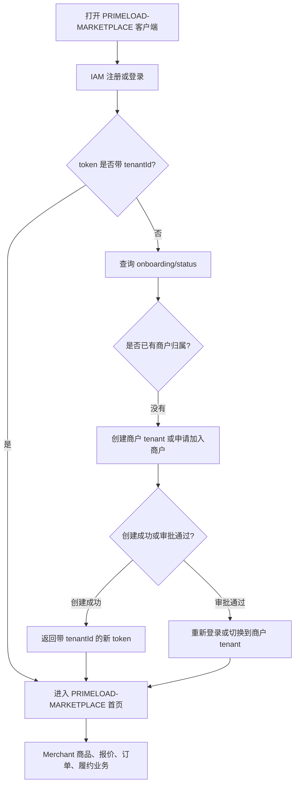

# PRIMELOAD-MARKETPLACE Merchant Onboarding Flow

## 1. Current Decision

PRIMELOAD-MARKETPLACE 的用户注册、登录、token、`auth/me` 都归 IAM。

Merchant 不再承接注册登录，也不再维护一套独立的商户注册入口。PRIMELOAD-MARKETPLACE 里的商户身份由 tenant 表达：

```text
PRIMELOAD-MARKETPLACE app + tenant_registry(tenant_type = MERCHANT) = merchant
```

也就是说：

- `iam_user` 表达账号。
- `iam_tenant_member` 表达账号加入了哪个商户。
- `tenant_registry` 表达商户主档。
- `business-merchant` 表达商户进入系统后的商品、报价、订单和履约业务。

## 2. Boundary

### IAM

IAM 负责：

- 注册账号。
- 登录账号。
- 签发 token。
- 返回当前用户身份。
- 校验用户是否属于当前 app。

PRIMELOAD-MARKETPLACE 注册登录入口：

```http
POST /api/primeload-marketplace/auth/register
POST /api/primeload-marketplace/auth/login
GET  /api/primeload-marketplace/auth/me
```

注册成功时，如果用户还没有商户归属，`tenantId` 可以是 `null`。

### Tenant

Tenant 负责：

- 判断当前用户是否已经有商户归属。
- 创建商户 tenant。
- 申请加入商户 tenant。
- 审批加入申请。
- 分配部门和角色。

PRIMELOAD-MARKETPLACE tenant 入口：

```http
GET  /api/primeload-marketplace/onboarding/status
POST /api/primeload-marketplace/tenants/workspaces
POST /api/primeload-marketplace/tenant-join-requests
```

兼容旧入口：

```http
POST /api/primeload-marketplace/tenants/projects
```

新代码优先使用 `/tenants/workspaces`。

### Merchant

Merchant 负责商户进入系统后的业务：

- 商家资料展示和补充。当前主档仍来自 `tenant_registry`。
- 商品。
- 目录。
- 报价。
- 订单。
- 交易履约。
- 调用 warehouse 完成库存、出库。
- 调用 logistics 完成发货、轨迹、签收。

Merchant 不负责：

- 注册账号。
- 登录账号。
- 创建 IAM 用户。
- 创建 tenant member。
- 维护独立商户注册表。

当前商户资料入口：

```http
GET /api/primeload-marketplace/merchant/profile
PUT /api/primeload-marketplace/merchant/profile
```

## 3. New User Flow



## 4. Create Merchant Flow

当用户选择“创建商户”：

```http
POST /api/primeload-marketplace/tenants/workspaces
```

请求示例：

```json
{
  "tenantName": "苏州某某五金商行",
  "projectAddress": "苏州工业园区星湖街 99 号",
  "managerName": "张栋俊",
  "managerPhone": "13800138000"
}
```

后端行为：

1. 创建 `tenant_registry`。
2. `appCode = PRIMELOAD-MARKETPLACE`。
3. `tenantType = MERCHANT`。
4. 创建者写入 `iam_tenant_member`。
5. 创建者获得 PRIMELOAD-MARKETPLACE 决策部负责人角色：`PRIMELOAD_MARKETPLACE_DECISION_LEADER`。
6. 返回新的 login token，token 内包含 `tenantId`。

响应中的 `tenantRegistry` 就是商户主档。

## 5. Join Merchant Flow

当用户选择“加入已有商户”：

```http
POST /api/primeload-marketplace/tenant-join-requests
```

请求可以按 `tenantId`，也可以按 `tenantKeyword`：

```json
{
  "tenantKeyword": "苏州某某五金商行",
  "applyMessage": "我是门店员工"
}
```

后端行为：

1. 创建加入申请。
2. 商户管理员审批。
3. 审批通过后创建或激活 `iam_tenant_member`。
4. 等待管理员分配部门角色，或按策略进入 READY。

## 6. Frontend State Machine

前端只需要围绕 `GET /api/primeload-marketplace/onboarding/status` 做状态机：

| status | 前端页面 |
| --- | --- |
| `NEED_CREATE_OR_JOIN` | 创建商户 / 加入商户 |
| `WAITING_APPROVAL` | 等待商户管理员审批 |
| `WAITING_ROLE_ASSIGNMENT` | 等待分配部门角色 |
| `READY` | 进入 PRIMELOAD-MARKETPLACE 首页 |

## 7. What Must Not Come Back

不要再恢复这些方向：

- `/api/primeload-marketplace/merchant/register`
- `/api/pmhub/public/register`
- solution 层自己创建 IAM 用户
- solution 层自己维护登录流程
- `MerchantMerchant` 作为商户注册主档
- PMHUB/PRIMELOAD-MARKETPLACE 默认 admin 作为客户端验证入口

WSGM 可以有平台默认管理员。PMHUB/PRIMELOAD-MARKETPLACE 是客户端用户自己注册、登录、创建或加入 tenant。
